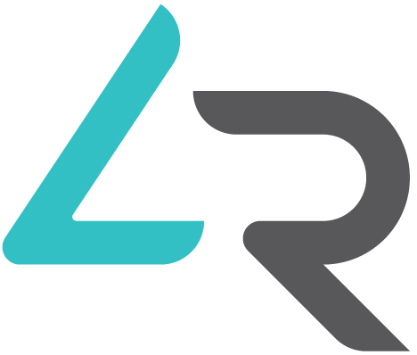

## Go4Rent - System Architecture

This document outlines the system architecture for the Go4Rent platform.

### 1. Overview

The Go4Rent platform consists of a Laravel-based backend, a MySQL database, a RESTful API for a Flutter mobile application, and a web-based Admin Dashboard. It integrates with several third-party services for payments, AI functionalities, push notifications, and email.

### 2. Components

#### 2.1. Laravel Backend (Core Application)
- **Framework:** Laravel (latest stable version)
- **Language:** PHP
- **Responsibilities:**
    - Business logic implementation for all features (user management, equipment, rentals, payments, contracts, AI interactions, admin functions, etc.).
    - Serving the RESTful API for the mobile application.
    - Serving the web interface for the Admin Dashboard.
    - Managing database interactions (CRUD operations, queries).
    - Handling authentication and authorization.
    - Integrating with third-party services.
    - Managing background jobs (e.g., sending emails, processing notifications, contract generation).
    - Implementing multi-language support (English/Arabic).

#### 2.2. MySQL Database
- **Type:** Relational Database (MySQL)
- **Responsibilities:**
    - Persistent storage for all application data (users, equipment, rentals, contracts, payments, settings, etc.).
    - Ensuring data integrity and consistency through schema design and constraints.
- **Schema:** As defined in `database_schema.md`.

#### 2.3. RESTful API
- **Architecture:** REST
- **Format:** JSON
- **Client:** Flutter Mobile Application
- **Responsibilities:**
    - Exposing backend functionalities to the mobile application.
    - Handling requests from the mobile app and returning appropriate JSON responses.
    - Ensuring API endpoints are optimized for mobile consumption (e.g., payload size, null handling).
    - Implementing versioning if future major changes are anticipated (e.g., /api/v1/).
- **Key API Modules (High-Level):**
    - Authentication (Login, Signup, OTP, Password Reset)
    - User Profile (CRUD, Verified Badge Request)
    - Equipment (Browse, Search, Details, AI Recommendations, Ratings/Reviews)
    - Rentals (Create, View History, Manage, Contract Signing via Barcode Scan)
    - Payments (Thawani, Wire Transfer Upload, Reward Points)
    - Contracts (View, Download PDF)
    - Damage Reports (Create, View)
    - Reward Points (View History, View Card)
    - Banners (Fetch for display)
    - General (e.g., fetching global settings like terms & conditions if needed by app)

#### 2.4. Admin Dashboard (Web Interface)
- **Type:** Web Application (served by Laravel)
- **Templating:** Blade (Laravel's templating engine)
- **Styling:** Custom CSS based on provided design guide (Teal, White, Dark Gray, Light Gray), modern, futuristic.
- **Responsibilities:**
    - Providing a comprehensive interface for administrators and staff to manage the platform.
    - All functionalities listed in `AdminDahsboard.txt` and `Project.txt` (User Management, Staff Management, Equipment & Inventory, Rentals, Contracts, Payments, Damage Reports, Rewards, Reports, Global Settings, Push Notifications, Banners, Email/Notification Templates, Review Management).
    - Multi-language UI support (English/Arabic), including RTL for Arabic.

#### 2.5. Flutter Mobile Application (Client - Out of Scope for Backend Dev)
- Interacts with the RESTful API.
- Handles user interface and user experience for customers.
- Implements features like barcode scanning, image capture for AI/damage reports.

### 3. Third-Party Integrations

#### 3.1. Thawani Payment Gateway
- **Purpose:** Processing online payments.
- **Integration:** Via Thawani E-commerce API.
- **Flow:** Backend initiates payment, redirects/provides data to app for Thawani interface, receives callback for payment status.
- **Configuration:** API keys stored securely in global settings.

#### 3.2. AI Providers (OpenAI & DeepSeek)
- **Purpose:** Equipment recognition, recommendations, and damage assessment.
- **Integration:** Via their respective APIs.
- **Flow:** Backend sends image/text data to AI API, receives analysis results.
- **Configuration:** API keys stored securely in global settings.

#### 3.3. Firebase (Firebase Cloud Messaging - FCM)
- **Purpose:** Sending push notifications to mobile app users.
- **Integration:** Via Firebase Admin SDK (for backend) or FCM API.
- **Flow:** Backend triggers notifications (e.g., marketing, rental updates) to specific users or topics.
- **Configuration:** Firebase project credentials/server key stored securely in global settings.

#### 3.4. Email Server (SMTP)
- **Purpose:** Sending transactional emails (OTP, confirmations, notifications).
- **Integration:** Laravel's built-in mail capabilities configured to use a specified SMTP server.
- **Configuration:** SMTP host, port, username, password, encryption stored securely in global settings.

### 4. Key Architectural Considerations

#### 4.1. Authentication & Authorization
- **API:** JWT (JSON Web Tokens) or Laravel Sanctum for token-based authentication for the mobile API.
- **Web Admin:** Laravel's session-based authentication.
- **Roles & Permissions:** `spatie/laravel-permission` package to manage user roles (customer, admin, staff) and potentially granular permissions.

#### 4.2. Multi-Language Support (i18n & l10n)
- **Database:** Translation tables for translatable model attributes (e.g., `equipment_translations`, `email_template_translations`) or JSON columns with a package like `spatie/laravel-translatable`.
- **Laravel:** Laravel's localization features (language files for static text, middleware for setting locale).
- **API:** Locale preference can be passed in request headers (e.g., `Accept-Language`) or as a user profile setting.
- **Admin Dashboard:** UI elements and content to be translatable.

#### 4.3. Barcode Generation & PDF Generation
- **Barcode:** A PHP library (e.g., `milon/barcode` for Laravel) will be used to generate barcode images (Code 128 or QR) for equipment. These will be displayed in the app and potentially on contracts.
- **PDF:** A PHP library (e.g., `barryvdh/laravel-dompdf` or `spatie/laravel-pdf`) for generating PDF contracts from HTML templates.

#### 4.4. Background Jobs / Queues
- **Purpose:** Offloading time-consuming tasks to improve application responsiveness (e.g., sending emails, push notifications, complex report generation, AI processing if it involves long waits).
- **Implementation:** Laravel Queues with a driver like Redis or database.

#### 4.5. Error Handling & Logging
- **Laravel:** Built-in error handling and logging mechanisms.
- **API:** Consistent error response formats (e.g., JSON with error codes and messages).

#### 4.6. Security
- Standard web application security practices (Input validation, XSS prevention, CSRF protection for web, SQL injection prevention via ORM).
- Secure storage of API keys and sensitive credentials (Laravel's .env and config files, potentially encrypted).
- HTTPS for all communications.

#### 4.7. Scalability (Considerations for Future)
- Stateless application design where possible to facilitate horizontal scaling.
- Efficient database queries and indexing.
- Use of caching (e.g., Redis) for frequently accessed data.

### 5. Directory Structure (Illustrative - Standard Laravel)
```
go4rent_backend/
├── app/
│   ├── Http/
│   │   ├── Controllers/
│   │   │   ├── Api/ (API Controllers)
│   │   │   └── Admin/ (Admin Dashboard Controllers)
│   │   ├── Middleware/
│   │   └── Requests/ (Form Requests for validation)
│   ├── Jobs/ (Background Jobs)
│   ├── Mail/ (Mailable classes)
│   ├── Models/ (Eloquent Models, including translation models or traits)
│   ├── Notifications/ (Laravel Notifications)
│   ├── Providers/
│   ├── Services/ (Business logic services, e.g., PaymentService, AiService)
│   └── ...
├── config/ (Application configuration)
├── database/
│   ├── factories/
│   ├── migrations/
│   └── seeders/
├── public/ (Web server root)
├── resources/
│   ├── lang/ (Language files for i18n)
│   ├── js/ (Admin JS)
│   ├── sass/ (Admin SASS)
│   └── views/
│       ├── admin/ (Admin dashboard Blade templates)
│       ├── emails/ (Email Blade templates)
│       └── pdf/ (PDF Blade templates for contracts)
├── routes/
│   ├── api.php (API routes)
│   └── web.php (Web/Admin routes)
├── storage/
├── tests/
└── ... (composer.json, .env, etc.)
```

### 6. Deployment (General)
- Web server (e.g., Nginx, Apache) with PHP-FPM.
- MySQL database server.
- Queue worker process(es).
- Scheduler (cron job for Laravel's scheduler).

This architecture provides a solid foundation for building the Go4Rent platform, addressing all specified requirements and ensuring a maintainable and scalable system.
